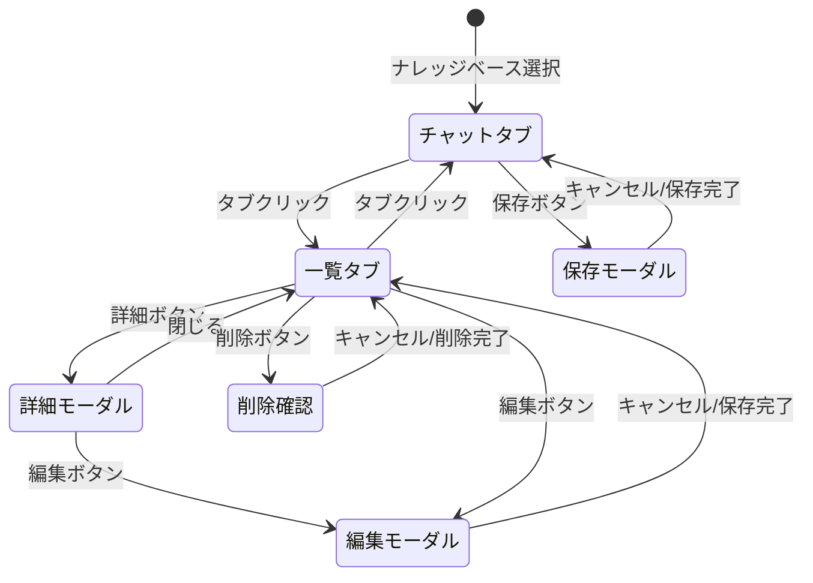

# 会社ナレッジベース 画面仕様書

## 1. 概要

### 1.1 機能概要
会社ナレッジベースは、議事録・会社情報をチャットUIで保存・検索できる機能です。
AIによる自動抽出機能で、要約・決定事項・宿題などを自動的に整理します。

### 1.2 画面構成図

```
┌─────────────────────────────────────────────────────────────────────────┐
│                              ヘッダー                                    │
├────────────┬────────────────────────────────────────────────────────────┤
│            │                                                            │
│            │  ┌──────────────────────────────────────────────────────┐  │
│   左       │  │  ユーザー選択 ▼  │  💬 チャット │ 📋 一覧          │  │
│   メ       │  ├──────────────────────────────────────────────────────┤  │
│   ニ       │  │                                                      │  │
│   ュ       │  │                  メインコンテンツ                     │  │
│   ー       │  │                  (チャット or 一覧)                   │  │
│            │  │                                                      │  │
│  ・営業    │  │                                                      │  │
│  ・提案    │  │                                                      │  │
│  ・コーチ  │  │                                                      │  │
│  ・アラート│  │                                                      │  │
│ ★ナレッジ │  ├──────────────────────────────────────────────────────┤  │
│            │  │  入力エリア                     [検索] [保存]        │  │
│            │  └──────────────────────────────────────────────────────┘  │
│            │                                                            │
└────────────┴────────────────────────────────────────────────────────────┘
```

---

## 2. 画面詳細

### 2.1 チャットタブ

#### レイアウト図
```
┌─────────────────────────────────────────────────────────────────┐
│  👤 田中太郎 ▼              💬 チャット  │  📋 一覧           │
├─────────────────────────────────────────────────────────────────┤
│                                                                 │
│  ┌───────────────────────────────────────────────────────────┐  │
│  │ 🤖 システム                                               │  │
│  │ 会社ナレッジベースへようこそ！議事録や会社情報を保存・    │  │
│  │ 検索できます。                                            │  │
│  └───────────────────────────────────────────────────────────┘  │
│                                                                 │
│  ┌───────────────────────────────────────────────────────────┐  │
│  │ 👤 ユーザー                                               │  │
│  │ 株式会社ABCとの打ち合わせ議事録です...                    │  │
│  └───────────────────────────────────────────────────────────┘  │
│                                                                 │
│  ┌───────────────────────────────────────────────────────────┐  │
│  │ 🤖 AI抽出結果                     [AI整形] [原文]        │  │
│  │ ┌─────────────────────────────────────────────────────┐   │  │
│  │ │ 📅 日付: 2026-01-15                                 │   │  │
│  │ │ 🏢 会社名: 株式会社ABC                              │   │  │
│  │ │                                                     │   │  │
│  │ │ 📝 要約                                             │   │  │
│  │ │ 新規システム導入について協議...                     │   │  │
│  │ │                                                     │   │  │
│  │ │ ✅ 決定事項                                         │   │  │
│  │ │ • 来月から試験導入開始                              │   │  │
│  │ │                                                     │   │  │
│  │ │ 📋 宿題                                             │   │  │
│  │ │ • 田中: 見積書作成 (期限: 1/20)                     │   │  │
│  │ │                                                     │   │  │
│  │ │ ➡️ 次回アクション                                   │   │  │
│  │ │ • 1/25 フォローアップMTG                            │   │  │
│  │ └─────────────────────────────────────────────────────┘   │  │
│  │                                    [💾 この内容で保存]    │  │
│  └───────────────────────────────────────────────────────────┘  │
│                                                                 │
├─────────────────────────────────────────────────────────────────┤
│  ┌─────────────────────────────────────────────────────────┐    │
│  │ メッセージを入力...                                     │    │
│  └─────────────────────────────────────────────────────────┘    │
│                                          [🔍 検索] [💾 保存]   │
└─────────────────────────────────────────────────────────────────┘
```

#### コンポーネント仕様

| # | コンポーネント | 説明 | 操作 |
|---|---------------|------|------|
| 1 | ユーザー選択 | ドロップダウン + 新規追加ボタン | クリックで選択、「+」で新規ユーザー追加モーダル |
| 2 | タブ切替 | チャット/一覧の切替 | クリックでタブ切替 |
| 3 | メッセージエリア | チャット履歴表示 | スクロール可能 |
| 4 | AI抽出プレビュー | 抽出結果のカード表示 | タブで整形/原文切替 |
| 5 | 入力エリア | テキスト入力欄 | Enter で送信 |
| 6 | 検索ボタン | 入力内容で検索実行 | クリックで検索API呼出 |
| 7 | 保存ボタン | 入力内容を保存 | クリックで保存モーダル表示 |

---

### 2.2 一覧タブ

#### レイアウト図
```
┌─────────────────────────────────────────────────────────────────┐
│  👤 田中太郎 ▼              💬 チャット  │  📋 一覧           │
├─────────────────────────────────────────────────────────────────┤
│                                                                 │
│  🔍 [会社名で検索...                                    ] [検索]│
│                                                                 │
│  ┌───────────────────────────────────────────────────────────┐  │
│  │ 🏢 株式会社ABC                           2026/01/15      │  │
│  │ 新規システム導入について協議。来月から試験導入を開始...   │  │
│  │                                    👤 田中太郎            │  │
│  │                              [詳細] [編集] [削除]         │  │
│  └───────────────────────────────────────────────────────────┘  │
│                                                                 │
│  ┌───────────────────────────────────────────────────────────┐  │
│  │ 🏢 株式会社XYZ                           2026/01/10      │  │
│  │ 契約更新についての打ち合わせ。現行プランの継続を確認...   │  │
│  │                                    👤 山田花子            │  │
│  │                              [詳細] [編集] [削除]         │  │
│  └───────────────────────────────────────────────────────────┘  │
│                                                                 │
│  ┌───────────────────────────────────────────────────────────┐  │
│  │ 🏢 DEF工業                               2026/01/08      │  │
│  │ 製品デモ実施。好感触を得られた...                         │  │
│  │                                    👤 田中太郎            │  │
│  │                              [詳細] [編集] [削除]         │  │
│  └───────────────────────────────────────────────────────────┘  │
│                                                                 │
│                         [< 前へ]  1 / 5  [次へ >]              │
└─────────────────────────────────────────────────────────────────┘
```

#### コンポーネント仕様

| # | コンポーネント | 説明 | 操作 |
|---|---------------|------|------|
| 1 | 検索バー | 会社名でフィルタリング | 入力で即時フィルタ or 検索ボタン |
| 2 | メモカード | 保存済みメモの一覧表示 | - |
| 3 | 詳細ボタン | 詳細モーダル表示 | クリックで詳細モーダル |
| 4 | 編集ボタン | 編集モーダル表示 | クリックで編集モーダル |
| 5 | 削除ボタン | 削除確認後に削除 | クリックで確認ダイアログ |
| 6 | ページネーション | ページ切替 | 前後ボタンでページ移動 |

---

### 2.3 保存モーダル

#### レイアウト図
```
┌─────────────────────────────────────────────────────────────────┐
│                     💾 メモを保存                         [×]  │
├─────────────────────────────────────────────────────────────────┤
│                                                                 │
│  会社名 *                                                       │
│  ┌─────────────────────────────────────────────────────────┐    │
│  │ 株式会社ABC                                         ▼   │    │
│  └─────────────────────────────────────────────────────────┘    │
│  💡 既存の会社名から選択、または新規入力                        │
│                                                                 │
│  メモ種別                                                       │
│  ┌─────────────────────────────────────────────────────────┐    │
│  │ 議事録                                              ▼   │    │
│  └─────────────────────────────────────────────────────────┘    │
│                                                                 │
│  ─────────────────────────────────────────────────────────────  │
│                                                                 │
│  📝 AI抽出プレビュー                                            │
│  ┌─────────────────────────────────────────────────────────┐    │
│  │ 📅 日付: 2026-01-15                                     │    │
│  │ 📝 要約: 新規システム導入について協議...                │    │
│  │ ✅ 決定事項: 来月から試験導入開始                       │    │
│  │ 📋 宿題: 田中 - 見積書作成                              │    │
│  └─────────────────────────────────────────────────────────┘    │
│                                                                 │
│                              [キャンセル]  [保存する]           │
└─────────────────────────────────────────────────────────────────┘
```

#### 入力項目

| 項目 | 種別 | 必須 | 説明 |
|------|------|------|------|
| 会社名 | コンボボックス | ◯ | 既存会社から選択 or 新規入力 |
| メモ種別 | ドロップダウン | - | 議事録/会社情報/その他 |

---

### 2.4 詳細モーダル

#### レイアウト図
```
┌─────────────────────────────────────────────────────────────────┐
│  🏢 株式会社ABC                                           [×]  │
├─────────────────────────────────────────────────────────────────┤
│                                                                 │
│  [AI整形]  [原文]                                               │
│  ━━━━━━━━━━━━━━━━━━━━━━━━━━━━━━━━━━━━━━━━━━━━━━━━━━━━━━━━━━━━━  │
│                                                                 │
│  ┌─────────────────────────────────────────────────────────┐    │
│  │                                                         │    │
│  │  📅 日付                                                │    │
│  │  2026年1月15日                                          │    │
│  │                                                         │    │
│  │  ─────────────────────────────────────────────────────  │    │
│  │                                                         │    │
│  │  📝 要約                                                │    │
│  │  新規システム導入について協議を行いました。             │    │
│  │  来月から試験導入を開始することで合意。                 │    │
│  │                                                         │    │
│  │  ─────────────────────────────────────────────────────  │    │
│  │                                                         │    │
│  │  ✅ 決定事項                                            │    │
│  │  • 来月から試験導入開始                                 │    │
│  │  • 初期費用は50万円で合意                               │    │
│  │                                                         │    │
│  │  ─────────────────────────────────────────────────────  │    │
│  │                                                         │    │
│  │  📋 宿題（アクションアイテム）                          │    │
│  │  ┌─────────────────────────────────────────────────┐    │    │
│  │  │ 担当者    │ タスク           │ 期限           │    │    │
│  │  ├─────────────────────────────────────────────────┤    │    │
│  │  │ 田中      │ 見積書作成       │ 2026/01/20     │    │    │
│  │  │ 山田      │ 契約書準備       │ 2026/01/22     │    │    │
│  │  └─────────────────────────────────────────────────┘    │    │
│  │                                                         │    │
│  │  ─────────────────────────────────────────────────────  │    │
│  │                                                         │    │
│  │  ➡️ 次回アクション                                      │    │
│  │  • 2026/01/25 - フォローアップMTG                       │    │
│  │                                                         │    │
│  │  ─────────────────────────────────────────────────────  │    │
│  │                                                         │    │
│  │  🔗 関連案件                                            │    │
│  │  • ABC社向けシステム開発プロジェクト                    │    │
│  │                                                         │    │
│  └─────────────────────────────────────────────────────────┘    │
│                                                                 │
│  ─────────────────────────────────────────────────────────────  │
│  📋 メタ情報                                                    │
│  登録者: 田中太郎  │  登録日時: 2026/01/15 14:30               │
│                                                                 │
│                                        [編集]  [閉じる]         │
└─────────────────────────────────────────────────────────────────┘
```

---

## 3. 画面遷移図



---

## 4. ユーザーフロー

### 4.1 議事録保存フロー

```
┌─────────┐     ┌─────────┐     ┌─────────┐     ┌─────────┐     ┌─────────┐
│ユーザー │     │テキスト │     │ 保存    │     │  AI     │     │ 保存    │
│ 選択    │ ──▶ │ 入力    │ ──▶ │ボタン   │ ──▶ │ 抽出    │ ──▶ │ 完了    │
└─────────┘     └─────────┘     └─────────┘     └─────────┘     └─────────┘
                    │                               │
                    │                               ▼
                    │                        ┌─────────────┐
                    │                        │ プレビュー  │
                    │                        │   確認      │
                    │                        └─────────────┘
                    │                               │
                    ▼                               ▼
              ┌─────────────┐              ┌─────────────┐
              │ 会社名選択  │ ◀────────── │ 会社名入力  │
              │ (自動補完)  │              │  (新規)     │
              └─────────────┘              └─────────────┘
```

### 4.2 検索フロー

```
┌─────────┐     ┌─────────┐     ┌─────────┐     ┌─────────┐
│ 検索    │     │   API   │     │ 結果    │     │ 詳細    │
│ 入力    │ ──▶ │  呼出   │ ──▶ │ 表示    │ ──▶ │ 表示    │
└─────────┘     └─────────┘     └─────────┘     └─────────┘
     │                              │
     ▼                              ▼
┌─────────────┐              ┌─────────────┐
│ チャット検索│              │  一覧検索   │
│ (自然言語)  │              │ (会社名)    │
└─────────────┘              └─────────────┘
```

---

## 5. API連携

### 5.1 エンドポイント一覧

| 画面操作 | Method | Endpoint | 説明 |
|----------|--------|----------|------|
| メモ保存 | POST | `/api/knowledge/memos` | 新規メモ作成 |
| メモ一覧 | GET | `/api/knowledge/memos` | メモ一覧取得 |
| メモ詳細 | GET | `/api/knowledge/memos/{id}` | メモ詳細取得 |
| メモ更新 | PUT | `/api/knowledge/memos/{id}` | メモ更新 |
| メモ削除 | DELETE | `/api/knowledge/memos/{id}` | メモ削除 |
| AI抽出 | POST | `/api/knowledge/extract` | AI抽出プレビュー |
| チャット | POST | `/api/knowledge/chat` | 自然言語検索 |
| 会社一覧 | GET | `/api/knowledge/companies` | 会社名リスト |
| ユーザー一覧 | GET | `/api/knowledge/users` | ユーザーリスト |
| ユーザー追加 | POST | `/api/knowledge/users` | ユーザー追加 |

### 5.2 シーケンス図

```
┌──────┐          ┌──────────┐          ┌──────┐          ┌────────┐
│Client│          │  API     │          │  DB  │          │ OpenAI │
└──┬───┘          └────┬─────┘          └──┬───┘          └───┬────┘
   │                   │                   │                  │
   │ POST /memos       │                   │                  │
   │ {original_text}   │                   │                  │
   │──────────────────▶│                   │                  │
   │                   │                   │                  │
   │                   │ Extract Request   │                  │
   │                   │──────────────────────────────────────▶
   │                   │                   │                  │
   │                   │ AI Extraction     │                  │
   │                   │◀──────────────────────────────────────
   │                   │                   │                  │
   │                   │ INSERT memo       │                  │
   │                   │──────────────────▶│                  │
   │                   │                   │                  │
   │                   │ memo_id           │                  │
   │                   │◀──────────────────│                  │
   │                   │                   │                  │
   │ {id, summary, ...}│                   │                  │
   │◀──────────────────│                   │                  │
   │                   │                   │                  │
```

---

## 6. データ構造

### 6.1 メモデータ

```typescript
interface CompanyMemo {
  id: number;
  lead_id: number | null;
  company_name: string;

  // 原文
  original_text: string;

  // AI抽出フィールド
  summary: string | null;
  decisions: string[] | null;
  action_items: ActionItem[] | null;
  next_actions: NextAction[] | null;
  meeting_date: string | null;  // YYYY-MM-DD
  related_projects: string[] | null;

  // メタデータ
  memo_type: 'meeting_note' | 'company_info' | 'other';
  registered_user_name: string | null;
  created_at: string;  // ISO 8601
  updated_at: string | null;
}

interface ActionItem {
  owner: string;
  task: string;
  deadline: string | null;
}

interface NextAction {
  action: string;
  date: string | null;
}
```

### 6.2 ユーザーデータ

```typescript
interface SimpleUser {
  id: number;
  name: string;
  department: string | null;
  is_active: boolean;
  created_at: string;
}
```

---

## 7. UI状態管理

### 7.1 状態一覧

| 状態 | 型 | 初期値 | 説明 |
|------|-----|--------|------|
| activeTab | 'chat' \| 'list' | 'chat' | 表示中タブ |
| messages | Message[] | [] | チャット履歴 |
| inputText | string | '' | 入力テキスト |
| selectedUser | User \| null | null | 選択中ユーザー |
| memos | Memo[] | [] | メモ一覧 |
| searchQuery | string | '' | 検索クエリ |
| isLoading | boolean | false | ローディング状態 |
| showSaveModal | boolean | false | 保存モーダル表示 |
| showDetailModal | boolean | false | 詳細モーダル表示 |
| selectedMemo | Memo \| null | null | 選択中メモ |
| extractionResult | Extraction \| null | null | AI抽出結果 |
| previewTab | 'formatted' \| 'original' | 'formatted' | プレビュータブ |

---

## 8. エラーハンドリング

### 8.1 エラー表示

| エラー種別 | 表示方法 | メッセージ例 |
|-----------|---------|-------------|
| API接続エラー | トースト通知 | 「サーバーに接続できません」 |
| 入力バリデーション | インライン | 「会社名は必須です」 |
| AI抽出失敗 | トースト通知 | 「AI抽出に失敗しました。原文で保存しますか？」 |
| 保存失敗 | トースト通知 | 「保存に失敗しました」 |
| 削除失敗 | トースト通知 | 「削除に失敗しました」 |

---

## 9. レスポンシブ対応

### 9.1 ブレークポイント

| 画面幅 | レイアウト変更 |
|--------|---------------|
| > 1024px | 通常表示（サイドバー + メイン） |
| 768px - 1024px | サイドバー縮小 |
| < 768px | サイドバー非表示、ハンバーガーメニュー |

---

## 10. アクセシビリティ

| 項目 | 対応 |
|------|------|
| キーボード操作 | Tab移動、Enter実行 |
| フォーカス表示 | アウトライン表示 |
| カラーコントラスト | WCAG AA準拠 |
| スクリーンリーダー | aria-label設定 |

---

## 付録: カラーパレット

```
┌─────────────────────────────────────────────────────────────┐
│ ダークテーマ                                                │
├─────────────────────────────────────────────────────────────┤
│ 背景(メイン)      #1a1a2e     ████████████████████         │
│ 背景(カード)      #16213e     ████████████████████         │
│ 背景(入力)        #0f0f1a     ████████████████████         │
│ テキスト(通常)    #e8e8e8     ████████████████████         │
│ テキスト(薄)      #888888     ████████████████████         │
│ アクセント        #4a9eff     ████████████████████         │
│ アクセント(緑)    #10b981     ████████████████████         │
│ ボーダー          #333333     ████████████████████         │
└─────────────────────────────────────────────────────────────┘
```
