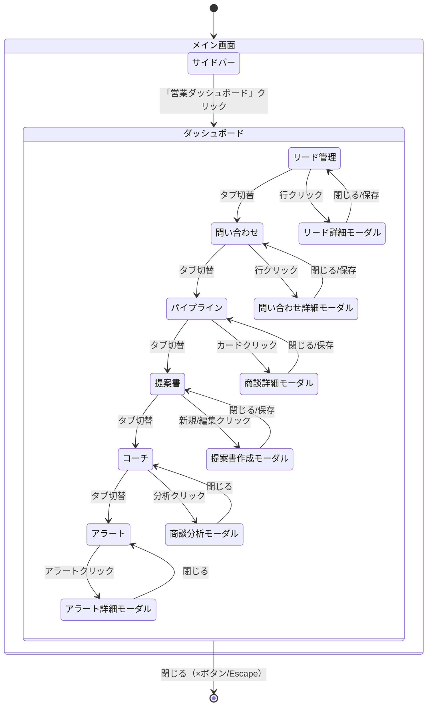

# 営業ダッシュボード 画面設計書

## 目次

1. [概要](#1-概要)
2. [全体構成](#2-全体構成)
3. [共通UI要素](#3-共通ui要素)
4. [タブ詳細](#4-タブ詳細)
   - 4.1 [リード管理](#41-リード管理タブ)
   - 4.2 [問い合わせ](#42-問い合わせタブ)
   - 4.3 [パイプライン](#43-パイプラインタブ)
   - 4.4 [提案書](#44-提案書タブ)
   - 4.5 [コーチ](#45-コーチタブ)
   - 4.6 [アラート](#46-アラートタブ)
5. [モーダル一覧](#5-モーダル一覧)
6. [API仕様](#6-api仕様)
7. [データ構造](#7-データ構造)
8. [画面遷移](#8-画面遷移)
9. [レスポンシブ対応](#9-レスポンシブ対応)

---

## 1. 概要

### 1.1 目的

営業活動の全体像を把握し、効率的な営業管理を実現するための統合ダッシュボード

### 1.2 基本情報

| 項目 | 内容 |
|-----|------|
| 表示方法 | メイン画面からモーダルとして表示 |
| トリガー | サイドバーの「営業ダッシュボード」ボタン |
| サイズ | 幅90%（最大1400px）× 高さ90% |

### 1.3 機能一覧

| タブ | 主な機能 |
|-----|---------|
| リード管理 | リード一覧、詳細、AI分析（BANT）、活動履歴 |
| 問い合わせ | 問い合わせ管理、SLA監視、AI回答生成 |
| パイプライン | 商談カンバン、売上予測、滞留アラート |
| 提案書 | テンプレート管理、見積作成、競合比較 |
| コーチ | スキル評価、トップ営業比較、商談分析 |
| アラート | 通知管理、アラートルール設定 |

---

## 2. 全体構成

### 2.1 レイアウト

```
┌─────────────────────────────────────────────────────────────────────────┐
│  営業ダッシュボード                                              [×]   │
├─────────────────────────────────────────────────────────────────────────┤
│  [リード管理] [問い合わせ] [パイプライン] [提案書] [コーチ] [アラート]   │
├─────────────────────────────────────────────────────────────────────────┤
│                                                                         │
│  ┌─────────────────────────────────────────────────────────────────┐    │
│  │                                                                 │    │
│  │                                                                 │    │
│  │                      タブコンテンツエリア                       │    │
│  │                      (各タブの内容が表示)                       │    │
│  │                                                                 │    │
│  │                                                                 │    │
│  │                                                                 │    │
│  └─────────────────────────────────────────────────────────────────┘    │
│                                                                         │
└─────────────────────────────────────────────────────────────────────────┘
```

### 2.2 構成要素

| 要素 | 説明 |
|-----|------|
| ヘッダー | タイトル「営業ダッシュボード」+ 閉じるボタン |
| タブナビゲーション | 6つのタブ切り替え |
| コンテンツエリア | 選択中タブの内容表示 |

---

## 3. 共通UI要素

### 3.1 サマリーカード

```
┌─────────┐ ┌─────────┐ ┌─────────┐ ┌─────────┐
│  ラベル  │ │  ラベル  │ │  ラベル  │ │  ラベル  │
│   数値   │ │   数値   │ │   数値   │ │   数値   │
│   増減   │ │   増減   │ │   増減   │ │   増減   │
└─────────┘ └─────────┘ └─────────┘ └─────────┘
```

- 主要KPIを一目で確認
- クリックでフィルタリング連動（一部）
- 前期比の増減表示

### 3.2 フィルターバー

```
🔍 フィルター                                    [+ フィルタ追加]
[ステータス ▼] [優先度 ▼] [担当者 ▼] [期間 ▼]    [クリア]
```

- 複数条件のAND検索
- 選択中フィルターはチップ表示
- クリアボタンで全解除

### 3.3 データテーブル

```
┌─────────────────────────────────────────────────────────────────┐
│ □ │ カラム1 ↑↓ │ カラム2 ↑↓ │ カラム3     │ カラム4     │ 操作  │
├─────────────────────────────────────────────────────────────────┤
│ □ │ データ      │ データ      │ データ      │ データ      │ ⋮    │
│ □ │ データ      │ データ      │ データ      │ データ      │ ⋮    │
│ □ │ データ      │ データ      │ データ      │ データ      │ ⋮    │
└─────────────────────────────────────────────────────────────────┘
                        [<] 1 2 3 ... 10 [>]     20件/ページ ▼
```

- ソート可能なカラムには ↑↓ 表示
- 行ホバーでハイライト
- 一括選択チェックボックス
- 操作メニュー（⋮）から詳細/編集/削除

### 3.4 ステータスバッジ

| ステータス | 色 | 用途 |
|-----------|-----|------|
| 🔴 赤 | 警告/未対応/高優先 | 要対応 |
| 🟡 黄 | 対応中/中優先 | 進行中 |
| 🟢 緑 | 完了/解決済/達成 | 良好 |
| 🔵 青 | 情報/受注 | 通知 |

---

## 4. タブ詳細

### 4.1 リード管理タブ

#### 画面レイアウト

```
┌─────────────────────────────────────────────────────────────────────────┐
│  📊 サマリーカード                                                      │
│  ┌─────────┐ ┌─────────┐ ┌─────────┐ ┌─────────┐ ┌─────────┐           │
│  │  総件数  │ │ アクティブ│ │   HOT   │ │  WARM   │ │ 期限切れ │           │
│  │   125   │ │    98    │ │   15   │ │   42   │ │    8    │           │
│  └─────────┘ └─────────┘ └─────────┘ └─────────┘ └─────────┘           │
│                                                                         │
│  🔍 フィルター                                      [+ 新規リード]       │
│  [ステータス ▼] [温度 ▼] [業界 ▼] [担当者 ▼]                            │
│                                                                         │
│  📋 リード一覧                                                          │
│  ┌─────────────────────────────────────────────────────────────────┐    │
│  │ 会社名         │ 担当者    │ 温度  │ スコア │ 次アクション │ 操作 │    │
│  ├─────────────────────────────────────────────────────────────────┤    │
│  │ 株式会社ABC    │ 田中太郎  │ 🔥HOT │  85   │ デモ日程調整 │ ⋮   │    │
│  │ 株式会社XYZ    │ 山田花子  │ 🟡WARM│  65   │ 資料送付    │ ⋮   │    │
│  │ DEF工業        │ 佐藤次郎  │ 🔵COLD│  40   │ フォロー電話│ ⋮   │    │
│  └─────────────────────────────────────────────────────────────────┘    │
│                                                                         │
│                           [<] 1 2 3 ... 10 [>]                          │
└─────────────────────────────────────────────────────────────────────────┘
```

#### サマリーカード定義

| カード | 計算方法 |
|-------|---------|
| 総件数 | COUNT(*) |
| アクティブ | status NOT IN ('won', 'lost') |
| HOT | temperature = 'hot' |
| WARM | temperature = 'warm' |
| 期限切れ | next_action_date < NOW() AND status NOT IN ('won', 'lost') |

#### 温度表示

| 温度 | アイコン | 説明 |
|-----|---------|------|
| HOT | 🔥 | 高確度（受注見込み高） |
| WARM | 🟡 | 中確度（検討段階） |
| COLD | 🔵 | 低確度（初期段階） |

#### フィルター項目

| フィルター | 選択肢 |
|-----------|-------|
| ステータス | 全て / 新規 / 商談中 / 提案済 / 受注 / 失注 |
| 温度 | 全て / HOT / WARM / COLD |
| 業界 | 全て / 製造業 / IT / 金融 / その他 |
| 担当者 | 全て / {担当者リスト} |

#### テーブルカラム

| カラム | 説明 | ソート |
|-------|------|-------|
| 会社名 | 会社名（クリックで詳細） | ○ |
| 担当者 | 営業担当者名 | ○ |
| 温度 | HOT/WARM/COLD | ○ |
| スコア | 優先度スコア（0-100） | ○ |
| 次アクション | 次の予定アクション + 日付 | ○ |
| 操作 | 詳細 / 編集 / 削除 | - |

---

### 4.2 問い合わせタブ

#### 画面レイアウト

```
┌─────────────────────────────────────────────────────────────────────────┐
│  📊 サマリーカード                                                      │
│  ┌─────────┐ ┌─────────┐ ┌─────────┐ ┌─────────┐ ┌─────────┐           │
│  │ 本日新規 │ │  未対応  │ │  対応中  │ │  解決済  │ │SLA違反  │           │
│  │    12   │ │    8    │ │    15   │ │    45   │ │    3    │           │
│  └─────────┘ └─────────┘ └─────────┘ └─────────┘ └─────────┘           │
│                                                                         │
│  📊 チャネル別統計                                                      │
│  ┌─────────────────────────────────────────────────────────────┐        │
│  │ 📧 メール: 45件    📞 電話: 23件    💬 チャット: 12件       │        │
│  └─────────────────────────────────────────────────────────────┘        │
│                                                                         │
│  🔍 フィルター                                      [+ 新規問い合わせ]   │
│  [ステータス ▼] [優先度 ▼] [チャネル ▼] [担当者 ▼]                      │
│                                                                         │
│  📋 問い合わせ一覧                                                      │
│  ┌─────────────────────────────────────────────────────────────────┐    │
│  │ ID  │ 件名              │ 顧客名    │ チャネル│ステータス│ SLA │    │
│  ├─────────────────────────────────────────────────────────────────┤    │
│  │ #123│ 料金プランについて │ 株式会社A │ 📧メール│ 🟡対応中│ ✅  │    │
│  │ #122│ 導入時期の相談    │ 株式会社B │ 📞電話 │ 🔴未対応│ ⚠️  │    │
│  │ #121│ 機能追加の要望    │ 個人C     │ 💬チャット│ 🟢解決済│ ✅  │    │
│  └─────────────────────────────────────────────────────────────────┘    │
│                                                                         │
│                           [<] 1 2 3 ... 10 [>]                          │
└─────────────────────────────────────────────────────────────────────────┘
```

#### サマリーカード定義

| カード | 計算方法 |
|-------|---------|
| 本日新規 | created_at = TODAY |
| 未対応 | status = 'open' |
| 対応中 | status = 'in_progress' |
| 解決済 | status = 'resolved' |
| SLA違反 | is_sla_breached = true |

#### チャネルアイコン

| チャネル | アイコン |
|---------|---------|
| メール | 📧 |
| 電話 | 📞 |
| チャット | 💬 |
| Web | 🌐 |

#### SLA設定

| 優先度 | SLA時間 |
|-------|---------|
| 高 | 30分 |
| 中 | 60分 |
| 低 | 120分 |

---

### 4.3 パイプラインタブ

#### 画面レイアウト

```
┌─────────────────────────────────────────────────────────────────────────┐
│  📊 パイプライン概要                                                    │
│  ┌─────────────────────────────────────────────────────────────────┐    │
│  │ 総パイプライン: ¥45,000,000    加重平均: ¥32,500,000            │    │
│  │ 受注率: 28%    平均リードタイム: 45日                           │    │
│  └─────────────────────────────────────────────────────────────────┘    │
│                                                                         │
│  📈 売上予測                                                            │
│  ┌─────────┐ ┌─────────┐ ┌─────────┐                                   │
│  │ 今月予測 │ │ 今四半期 │ │ 今期予測 │                                   │
│  │¥8,500,000│ │¥25,000,000│ │¥85,000,000│                                │
│  │ 高:¥5M   │ │ 高:¥15M  │ │ 高:¥50M  │                                  │
│  │ 中:¥2.5M │ │ 中:¥7M   │ │ 中:¥25M  │                                  │
│  │ 低:¥1M   │ │ 低:¥3M   │ │ 低:¥10M  │                                  │
│  └─────────┘ └─────────┘ └─────────┘                                   │
│                                                                         │
│  🎯 ステージ別パイプライン（カンバンビュー）                            │
│  ┌──────────┬──────────┬──────────┬──────────┬──────────┐              │
│  │ 初回商談 │ 提案中   │ 見積提出 │ 最終交渉 │ 受注     │              │
│  │ 8件      │ 6件      │ 4件      │ 2件      │ 5件      │              │
│  │ ¥12M     │ ¥15M     │ ¥10M     │ ¥5M      │ ¥8M      │              │
│  ├──────────┼──────────┼──────────┼──────────┼──────────┤              │
│  │┌────────┐│┌────────┐│┌────────┐│┌────────┐│┌────────┐│              │
│  ││ABC社   ││├XYZ社   ││├DEF社   ││├GHI社   ││├JKL社   ││              │
│  ││¥2M 30% ││├¥3M 50% ││├¥2.5M60%││├¥2.5M80%││├¥1.5M   ││              │
│  │└────────┘│└────────┘│└────────┘│└────────┘│└────────┘│              │
│  └──────────┴──────────┴──────────┴──────────┴──────────┘              │
│                                                                         │
│  ⚠️ 滞留アラート                                                        │
│  ┌─────────────────────────────────────────────────────────────────┐    │
│  │ 🔴 株式会社STU - 提案中で21日滞留（¥3M、確度60%）[対応する]     │    │
│  │ 🟡 株式会社VWX - 見積提出で14日滞留（¥2M、確度50%）[対応する]   │    │
│  └─────────────────────────────────────────────────────────────────┘    │
└─────────────────────────────────────────────────────────────────────────┘
```

#### ステージ定義

| ステージ | 説明 | 標準確度 |
|---------|------|---------|
| first_meeting | 初回商談 | 10% |
| proposal | 提案中 | 30% |
| quote | 見積提出 | 50% |
| negotiation | 最終交渉 | 70% |
| closed_won | 受注 | 100% |
| closed_lost | 失注 | 0% |

#### 売上予測の確度区分

| 確度区分 | 条件 |
|---------|------|
| 高確度 | probability >= 70% |
| 中確度 | 40% <= probability < 70% |
| 低確度 | probability < 40% |

#### 滞留アラート基準

| 重要度 | 条件 | アイコン |
|-------|------|---------|
| 高 | 21日以上滞留 | 🔴 |
| 中 | 14-20日滞留 | 🟡 |
| 低 | 7-13日滞留 | 🟢 |

#### カンバン操作

- カードはドラッグ&ドロップでステージ移動
- カードクリックで商談詳細モーダル表示
- ステージ移動時に確度自動更新オプション

---

### 4.4 提案書タブ

#### 画面レイアウト

```
┌─────────────────────────────────────────────────────────────────────────┐
│  📂 テンプレート                               [+ 新規テンプレート]       │
│  ┌─────────────────────────────────────────────────────────────────┐    │
│  │ 📄 製造業向け基本        📄 IT企業向け        📄 小規模企業向け │    │
│  │ 📄 大企業向け            📄 金融業界向け      📄 [+追加]        │    │
│  └─────────────────────────────────────────────────────────────────┘    │
│                                                                         │
│  📝 提案書一覧                                   [+ 新規提案書]          │
│  ┌─────────────────────────────────────────────────────────────────┐    │
│  │ タイトル            │ 顧客         │ ステータス │ 作成日  │ 操作 │    │
│  ├─────────────────────────────────────────────────────────────────┤    │
│  │ CRMシステム導入提案 │ 株式会社ABC  │ 🟡作成中  │ 1/15   │ ⋮   │    │
│  │ ERPリプレース提案   │ 株式会社XYZ  │ 🟢送付済  │ 1/10   │ ⋮   │    │
│  │ クラウド移行提案    │ DEF工業      │ 🔵受注    │ 1/05   │ ⋮   │    │
│  └─────────────────────────────────────────────────────────────────┘    │
│                                                                         │
│  🏆 過去の受注提案書                                                    │
│  ┌─────────────────────────────────────────────────────────────────┐    │
│  │ 業界      │ 企業規模  │ 受注金額    │ 成功要因              │ 参照 │    │
│  ├─────────────────────────────────────────────────────────────────┤    │
│  │ 製造業    │ 100-500名 │ ¥5,000,000  │ ROI明確化、導入事例   │ 📄  │    │
│  │ IT        │ 50-100名  │ ¥3,000,000  │ 競合比較、カスタマイズ │ 📄  │    │
│  └─────────────────────────────────────────────────────────────────┘    │
│                                                                         │
│  🤖 競合管理                                     [+ 競合を追加]          │
│  ┌─────────────────────────────────────────────────────────────────┐    │
│  │ 競合名      │ 強み           │ 弱み           │ 操作            │    │
│  ├─────────────────────────────────────────────────────────────────┤    │
│  │ 競合A社     │ 価格           │ サポート       │ [比較表] [編集] │    │
│  │ 競合B社     │ 機能           │ 導入期間       │ [比較表] [編集] │    │
│  └─────────────────────────────────────────────────────────────────┘    │
└─────────────────────────────────────────────────────────────────────────┘
```

#### 提案書ステータス

| ステータス | アイコン | 説明 |
|-----------|---------|------|
| 作成中 | 🟡 | 編集中 |
| 送付済 | 🟢 | 顧客に送付済み |
| 受注 | 🔵 | 提案が受注 |
| 失注 | 🔴 | 提案が失注 |

#### AI機能

| 機能 | 説明 |
|-----|------|
| ストーリー生成 | 顧客課題に基づく提案ストーリー自動生成 |
| 見積自動生成 | 過去データから見積もり項目を推薦 |
| 類似案件推薦 | 類似の受注案件から成功要因を分析 |
| 競合比較生成 | 競合との比較表・トークポイント自動生成 |

---

### 4.5 コーチタブ

#### 画面レイアウト

```
┌─────────────────────────────────────────────────────────────────────────┐
│  👤 社員選択: [田中太郎 ▼]                                              │
│                                                                         │
│  📊 スキル評価                                    [🔄 再評価]            │
│  ┌─────────────────────────────────────────────────────────────────┐    │
│  │                        ヒアリング力                             │    │
│  │                            80                                   │    │
│  │                          ╱    ╲                                 │    │
│  │        課題発見力  65  ●        ●  70 提案力                   │    │
│  │                        │        │                              │    │
│  │                        │   ●    │                              │    │
│  │                        │   50   │                              │    │
│  │   コミュニケーション 80●        ●75 商品知識                   │    │
│  │                          ╲    ╱                                 │    │
│  │                       クロージング力                            │    │
│  └─────────────────────────────────────────────────────────────────┘    │
│                                                                         │
│  🏆 トップ営業との比較                                                  │
│  ┌─────────────────────────────────────────────────────────────────┐    │
│  │ 指標            │ あなた │ トップ平均 │ ギャップ               │    │
│  ├─────────────────────────────────────────────────────────────────┤    │
│  │ 受注率          │ 25%    │ 35%        │ -10%   🔴              │    │
│  │ 平均案件金額    │ ¥2.5M  │ ¥3.2M      │ -¥0.7M 🟡              │    │
│  │ クロージング力  │ 50     │ 78         │ -28    🔴              │    │
│  │ ヒアリング力    │ 80     │ 82         │ -2     🟢              │    │
│  └─────────────────────────────────────────────────────────────────┘    │
│                                                                         │
│  📝 商談ログ                                       [+ 新規ログ]          │
│  ┌─────────────────────────────────────────────────────────────────┐    │
│  │ 日付    │ 顧客        │ 評価  │ 操作                           │    │
│  ├─────────────────────────────────────────────────────────────────┤    │
│  │ 1/15   │ 株式会社ABC │ 72点  │ [分析] [改善提案] [詳細]       │    │
│  │ 1/10   │ 株式会社XYZ │ 85点  │ [分析] [改善提案] [詳細]       │    │
│  └─────────────────────────────────────────────────────────────────┘    │
│                                                                         │
│  💡 ベストプラクティス                                                  │
│  ┌─────────────────────────────────────────────────────────────────┐    │
│  │ 📚 初回商談のコツ    📚 クロージングテクニック   📚 ヒアリング術│    │
│  │ 📚 価格交渉          📚 反論対応                📚 フォローアップ│    │
│  └─────────────────────────────────────────────────────────────────┘    │
└─────────────────────────────────────────────────────────────────────────┘
```

#### スキル評価項目

| スキル | 説明 |
|-------|------|
| ヒアリング力 | 顧客課題を引き出す力 |
| 提案力 | 解決策を提案する力 |
| 商品知識 | 自社製品の理解度 |
| クロージング力 | 契約に導く力 |
| コミュニケーション | 対人関係構築力 |
| 課題発見力 | 潜在課題を見つける力 |

#### ギャップ表示

| アイコン | 意味 |
|---------|------|
| 🟢 | ギャップ小（±5以内） |
| 🟡 | ギャップ中（±5-15） |
| 🔴 | ギャップ大（±15以上） |

#### AI分析機能

| 機能 | 説明 |
|-----|------|
| 文字起こし | 音声ファイルからテキスト変換 |
| 商談要約 | 議事録から要点を抽出 |
| NGワード検出 | 不適切なワードを検出 |
| トーク改善 | より効果的な表現を提案 |
| 総合評価 | 商談全体を100点満点で評価 |

---

### 4.6 アラートタブ

#### 画面レイアウト

```
┌─────────────────────────────────────────────────────────────────────────┐
│  📊 アラートサマリー                                                    │
│  ┌─────────┐ ┌─────────┐ ┌─────────┐ ┌─────────┐                        │
│  │  未読   │ │  高優先  │ │ フォロー │ │  SLA   │                        │
│  │   12   │ │    5    │ │    4    │ │    3   │                        │
│  └─────────┘ └─────────┘ └─────────┘ └─────────┘                        │
│                                                                         │
│  🔔 アラート一覧                           [全て既読にする] [🔄 更新]   │
│                                                                         │
│  🔴 高優先                                                              │
│  ┌─────────────────────────────────────────────────────────────────┐    │
│  │ ⚠️ フォローアップ期限切れ: 株式会社ABC              1時間前     │    │
│  │    次アクション「デモ日程調整」の期限が過ぎています              │    │
│  │    [対応する] [却下]                                             │    │
│  └─────────────────────────────────────────────────────────────────┘    │
│  ┌─────────────────────────────────────────────────────────────────┐    │
│  │ ⚠️ SLA違反: 問い合わせ#123                          2時間前     │    │
│  │    初回対応SLA（60分）を超過しています                           │    │
│  │    [対応する] [却下]                                             │    │
│  └─────────────────────────────────────────────────────────────────┘    │
│                                                                         │
│  🟡 中優先                                                              │
│  ┌─────────────────────────────────────────────────────────────────┐    │
│  │ 📊 案件滞留: 株式会社XYZ                            1日前        │    │
│  │    「提案中」ステージで14日間進捗なし                            │    │
│  │    [対応する] [却下]                                             │    │
│  └─────────────────────────────────────────────────────────────────┘    │
│                                                                         │
│  ⚙️ アラートルール                               [+ ルール追加]         │
│  ┌─────────────────────────────────────────────────────────────────┐    │
│  │ ルール名                    │ 条件              │ 有効│ 操作    │    │
│  ├─────────────────────────────────────────────────────────────────┤    │
│  │ フォローアップ期限          │ 期限超過          │ ✅  │ [編集]  │    │
│  │ 案件滞留（14日）            │ 更新なし14日以上  │ ✅  │ [編集]  │    │
│  │ SLA違反                     │ 初回対応60分超過  │ ✅  │ [編集]  │    │
│  │ HOTリード未対応             │ HOT + 3日未対応   │ ⬜  │ [編集]  │    │
│  └─────────────────────────────────────────────────────────────────┘    │
└─────────────────────────────────────────────────────────────────────────┘
```

#### アラートタイプ

| タイプ | アイコン | 説明 |
|-------|---------|------|
| follow_up | ⚠️ | フォローアップ期限切れ |
| stalled_deal | 📊 | 案件滞留 |
| inquiry_sla | ⏰ | SLA違反 |
| hot_lead | 🔥 | HOTリード未対応 |

#### アラート生成ルール

| ルール | トリガー条件 |
|-------|-------------|
| フォローアップ期限 | next_action_date < NOW() AND status NOT IN ('won', 'lost') |
| 案件滞留 | updated_at < NOW() - 14days AND stage NOT IN ('closed_won', 'closed_lost') |
| SLA違反 | first_response_at IS NULL AND created_at + sla_target < NOW() |
| HOTリード未対応 | temperature = 'hot' AND last_contact_date < NOW() - 3days |

---

## 5. モーダル一覧

### 5.1 リード詳細モーダル

```
┌─────────────────────────────────────────────────────────────┐
│  株式会社ABC                                          [×]  │
├─────────────────────────────────────────────────────────────┤
│  [基本情報] [活動履歴] [AI分析]                              │
├─────────────────────────────────────────────────────────────┤
│                                                             │
│  【基本情報タブ】                                            │
│  ┌─────────────────────────────────────────────────────┐    │
│  │ 会社名:       株式会社ABC                           │    │
│  │ 担当者:       田中太郎                              │    │
│  │ メール:       tanaka@abc.co.jp                      │    │
│  │ 電話:         03-1234-5678                          │    │
│  │ 業界:         製造業                                │    │
│  │ 企業規模:     50-100名                              │    │
│  │ 想定金額:     ¥5,000,000                            │    │
│  │ ステータス:   [商談中 ▼]                             │    │
│  │ 温度:         [HOT ▼]                               │    │
│  │ 次アクション: [________________]                    │    │
│  │ 次アクション日: [2026-01-20]                        │    │
│  └─────────────────────────────────────────────────────┘    │
│                                                             │
│  【活動履歴タブ】                                            │
│  ┌─────────────────────────────────────────────────────┐    │
│  │ 1/15 📞 電話 - 初回ヒアリング完了                   │    │
│  │ 1/10 📧 メール - 資料送付                           │    │
│  │ 1/05 🤝 商談 - オンラインデモ実施                   │    │
│  │                              [+ 活動を追加]         │    │
│  └─────────────────────────────────────────────────────┘    │
│                                                             │
│  【AI分析タブ】                                              │
│  ┌─────────────────────────────────────────────────────┐    │
│  │ 📊 BANT分析                                         │    │
│  │ Budget:    ████████░░ 80%                           │    │
│  │ Authority: ██████░░░░ 60%                           │    │
│  │ Need:      █████████░ 90%                           │    │
│  │ Timeline:  ███████░░░ 70%                           │    │
│  │                                                     │    │
│  │ 💡 推奨アクション:                                  │    │
│  │ • 決裁者への直接アプローチを検討                    │    │
│  │ • 競合状況のヒアリングを実施                        │    │
│  │                               [🔄 再分析]           │    │
│  └─────────────────────────────────────────────────────┘    │
│                                                             │
│                            [キャンセル] [保存]              │
└─────────────────────────────────────────────────────────────┘
```

### 5.2 問い合わせ詳細モーダル

```
┌─────────────────────────────────────────────────────────────┐
│  #123 料金プランについて                              [×]  │
├─────────────────────────────────────────────────────────────┤
│                                                             │
│  ステータス: [対応中 ▼]    優先度: [高 ▼]    担当: [田中 ▼] │
│                                                             │
│  📝 問い合わせ内容                                          │
│  ┌─────────────────────────────────────────────────────┐    │
│  │ 御社のCRMシステムの料金プランについて教えてください。│    │
│  │ 50名規模の会社で利用を検討しています。              │    │
│  │                                                     │    │
│  │ 株式会社A 山田                                      │    │
│  │ yamada@company-a.co.jp                              │    │
│  │ 2026/01/15 14:30                                    │    │
│  └─────────────────────────────────────────────────────┘    │
│                                                             │
│  ⏱️ SLA情報                                                 │
│  ┌─────────────────────────────────────────────────────┐    │
│  │ 目標: 60分以内    経過: 45分    残り: 15分          │    │
│  │ ████████████████████░░░░░░░░░░                      │    │
│  └─────────────────────────────────────────────────────┘    │
│                                                             │
│  💬 対応履歴                                                │
│  ┌─────────────────────────────────────────────────────┐    │
│  │ 1/15 15:00 田中太郎                                 │    │
│  │ お問い合わせありがとうございます。料金プランに...   │    │
│  └─────────────────────────────────────────────────────┘    │
│                                                             │
│  📝 返信作成                                                │
│  ┌─────────────────────────────────────────────────────┐    │
│  │                                                     │    │
│  └─────────────────────────────────────────────────────┘    │
│  [🤖 AI回答生成]                              [送信]        │
│                                                             │
└─────────────────────────────────────────────────────────────┘
```

### 5.3 商談詳細モーダル

```
┌─────────────────────────────────────────────────────────────┐
│  株式会社ABC - CRM導入案件                            [×]  │
├─────────────────────────────────────────────────────────────┤
│                                                             │
│  📊 案件情報                                                │
│  ┌─────────────────────────────────────────────────────┐    │
│  │ 案件名:      CRM導入案件                            │    │
│  │ 金額:        ¥5,000,000                             │    │
│  │ ステージ:    [提案中 ▼]                              │    │
│  │ 確度:        [50% ▼]                                 │    │
│  │ クローズ予定: [2026-02-28]                           │    │
│  │ 担当者:      [田中太郎 ▼]                            │    │
│  └─────────────────────────────────────────────────────┘    │
│                                                             │
│  📈 進捗グラフ                                              │
│  ┌─────────────────────────────────────────────────────┐    │
│  │ 初回 ──●── 提案 ──○── 見積 ──○── 交渉 ──○── 受注   │    │
│  │      1/5      1/15                                  │    │
│  └─────────────────────────────────────────────────────┘    │
│                                                             │
│  📝 活動履歴                                                │
│  ┌─────────────────────────────────────────────────────┐    │
│  │ 1/15 📝 提案書提出                                  │    │
│  │ 1/10 🤝 オンラインデモ実施                          │    │
│  │ 1/05 📞 初回ヒアリング                              │    │
│  │                              [+ 活動を追加]         │    │
│  └─────────────────────────────────────────────────────┘    │
│                                                             │
│                            [キャンセル] [保存]              │
└─────────────────────────────────────────────────────────────┘
```

### 5.4 提案書作成モーダル

```
┌─────────────────────────────────────────────────────────────┐
│  提案書作成                                            [×]  │
├─────────────────────────────────────────────────────────────┤
│  [基本情報] [構成] [見積] [AI生成] [出力]                    │
├─────────────────────────────────────────────────────────────┤
│                                                             │
│  【基本情報タブ】                                            │
│  タイトル:    [________________________]                   │
│  顧客:        [株式会社ABC ▼]                               │
│  テンプレート:[製造業向け基本 ▼]                            │
│                                                             │
│  【構成タブ】                                                │
│  ┌─────────────────────────────────────────────────────┐    │
│  │ ⋮⋮ 1. 御社の課題                              [×]   │    │
│  │ ⋮⋮ 2. 弊社ソリューション                      [×]   │    │
│  │ ⋮⋮ 3. 導入効果                                [×]   │    │
│  │ ⋮⋮ 4. 導入スケジュール                        [×]   │    │
│  │ ⋮⋮ 5. お見積り                                [×]   │    │
│  │                               [+ セクション追加]     │    │
│  └─────────────────────────────────────────────────────┘    │
│                                                             │
│  【見積タブ】                                                │
│  ┌─────────────────────────────────────────────────────┐    │
│  │ 項目           │ 単価    │ 数量 │ 金額       │ 削除 │    │
│  │ ライセンス費用 │ ¥5,000  │ 50   │ ¥250,000   │ [×] │    │
│  │ 導入支援       │¥150,000 │ 1    │ ¥150,000   │ [×] │    │
│  │                           小計: │ ¥400,000   │      │    │
│  │                 割引(   %):  -¥ │            │      │    │
│  │                           税:   │ ¥40,000    │      │    │
│  │                           合計: │ ¥440,000   │      │    │
│  │                               [+ 項目追加]          │    │
│  └─────────────────────────────────────────────────────┘    │
│                                                             │
│  【AI生成タブ】                                              │
│  [📝 ストーリー生成] [💰 見積自動生成] [🏆 類似案件から推薦] │
│                                                             │
│  【出力タブ】                                                │
│  [📄 PDF出力] [📊 PPTX出力]                                 │
│                                                             │
│                            [キャンセル] [保存]              │
└─────────────────────────────────────────────────────────────┘
```

### 5.5 商談分析モーダル

```
┌─────────────────────────────────────────────────────────────┐
│  商談分析: 株式会社ABC (1/15)                          [×]  │
├─────────────────────────────────────────────────────────────┤
│                                                             │
│  🎤 音声アップロード                                        │
│  ┌─────────────────────────────────────────────────────┐    │
│  │          📎 ファイルをドロップまたはクリック         │    │
│  │              対応形式: mp3, m4a, wav                 │    │
│  └─────────────────────────────────────────────────────┘    │
│  または                                                     │
│  📝 議事録テキスト                                          │
│  ┌─────────────────────────────────────────────────────┐    │
│  │                                                     │    │
│  └─────────────────────────────────────────────────────┘    │
│                                                             │
│  [🎙️ 文字起こし開始] [📊 分析開始]                          │
│                                                             │
│  📊 分析結果                                                │
│  ┌─────────────────────────────────────────────────────┐    │
│  │ **総合スコア: 72/100**                              │    │
│  │                                                     │    │
│  │ ✅ 良かった点:                                      │    │
│  │ • ヒアリングで顧客課題を引き出せていた              │    │
│  │ • 製品説明が分かりやすかった                        │    │
│  │                                                     │    │
│  │ ⚠️ 改善点:                                          │    │
│  │ • クロージングが弱い                                │    │
│  │ • NGワード「できません」を3回使用                   │    │
│  │                                                     │    │
│  │ 💡 推奨スクリプト:                                  │    │
│  │ > 「具体的な導入時期について...」                   │    │
│  └─────────────────────────────────────────────────────┘    │
│                                                             │
│                                        [閉じる]             │
└─────────────────────────────────────────────────────────────┘
```

### 5.6 確認モーダル（共通）

```
┌─────────────────────────────────────────────────────────────┐
│                           ⚠️                                │
│                                                             │
│                      {確認メッセージ}                        │
│                                                             │
│              [{キャンセル}]  [{実行}]                        │
└─────────────────────────────────────────────────────────────┘
```

---

## 6. API仕様

### 6.1 リード管理API

| エンドポイント | Method | 説明 |
|--------------|--------|------|
| `/api/sales/leads` | GET | リード一覧 |
| `/api/sales/leads` | POST | リード作成 |
| `/api/sales/leads/{id}` | GET | リード詳細 |
| `/api/sales/leads/{id}` | PUT | リード更新 |
| `/api/sales/leads/{id}` | DELETE | リード削除 |
| `/api/sales/leads/{id}/analyze` | POST | AI分析（BANT） |
| `/api/sales/leads/{id}/activities` | GET | 活動履歴取得 |
| `/api/sales/leads/{id}/activities` | POST | 活動追加 |
| `/api/sales/leads/stats` | GET | 統計情報 |

### 6.2 問い合わせAPI

| エンドポイント | Method | 説明 |
|--------------|--------|------|
| `/api/sales/inquiries` | GET | 問い合わせ一覧 |
| `/api/sales/inquiries` | POST | 問い合わせ作成 |
| `/api/sales/inquiries/{id}` | GET | 問い合わせ詳細 |
| `/api/sales/inquiries/{id}` | PUT | 問い合わせ更新 |
| `/api/sales/inquiries/{id}/responses` | GET | 対応履歴 |
| `/api/sales/inquiries/{id}/responses` | POST | 返信追加 |
| `/api/sales/inquiries/{id}/generate-response` | POST | AI回答生成 |
| `/api/sales/inquiries/stats` | GET | 統計情報 |
| `/api/sales/inquiries/channel-stats` | GET | チャネル別統計 |

### 6.3 パイプラインAPI

| エンドポイント | Method | 説明 |
|--------------|--------|------|
| `/api/sales/pipeline/deals` | GET | 商談一覧 |
| `/api/sales/pipeline/deals` | POST | 商談作成 |
| `/api/sales/pipeline/deals/{id}` | GET | 商談詳細 |
| `/api/sales/pipeline/deals/{id}` | PUT | 商談更新（ステージ変更含む） |
| `/api/sales/pipeline/deals/{id}` | DELETE | 商談削除 |
| `/api/sales/pipeline/analytics` | GET | パイプライン分析 |
| `/api/sales/pipeline/forecast` | GET | 売上予測 |
| `/api/sales/pipeline/stalled-alerts` | GET | 滞留アラート |
| `/api/sales/pipeline/by-owner` | GET | 担当者別 |

### 6.4 提案書API

| エンドポイント | Method | 説明 |
|--------------|--------|------|
| `/api/proposals` | GET | 提案書一覧 |
| `/api/proposals` | POST | 提案書作成 |
| `/api/proposals/{id}` | GET | 提案書詳細 |
| `/api/proposals/{id}` | PUT | 提案書更新 |
| `/api/proposals/{id}/quote` | POST | 見積保存 |
| `/api/proposals/{id}/export/pdf` | GET | PDF出力 |
| `/api/proposals/{id}/export/pptx` | GET | PPTX出力 |
| `/api/proposals/templates` | GET/POST | テンプレートCRUD |
| `/api/proposals/competitors` | GET/POST | 競合CRUD |
| `/api/proposals/won-proposals` | GET/POST | 受注提案書 |
| `/api/proposals/ai/generate-story` | POST | ストーリー生成 |
| `/api/proposals/ai/generate-quote` | POST | 見積自動生成 |
| `/api/proposals/ai/competitor-comparison` | POST | 競合比較生成 |

### 6.5 コーチAPI

| エンドポイント | Method | 説明 |
|--------------|--------|------|
| `/api/coach/employees` | GET | 社員一覧 |
| `/api/coach/employees/{id}/skills` | GET | スキル評価 |
| `/api/coach/employees/{id}/skills/assess` | POST | スキル自動評価 |
| `/api/coach/employees/{id}/compare-top-performers` | GET | トップ比較 |
| `/api/coach/meetings` | GET | 商談ログ一覧 |
| `/api/coach/meetings` | POST | 商談ログ作成 |
| `/api/coach/meetings/{id}` | GET | 商談ログ詳細 |
| `/api/coach/meetings/{id}/summarize` | POST | AI要約 |
| `/api/coach/meetings/{id}/detect-ng-words` | POST | NGワード検出 |
| `/api/coach/meetings/{id}/improve-talk` | POST | トーク改善 |
| `/api/coach/meetings/{id}/full-analysis` | POST | 総合分析 |
| `/api/coach/meetings/transcribe` | POST | 音声文字起こし |
| `/api/coach/best-practices` | GET | ベストプラクティス |
| `/api/coach/best-practices/{topic}` | GET | トピック詳細 |

### 6.6 アラートAPI

| エンドポイント | Method | 説明 |
|--------------|--------|------|
| `/api/alerts` | GET | アラート一覧 |
| `/api/alerts` | POST | アラート作成 |
| `/api/alerts/{id}/read` | PUT | 既読にする |
| `/api/alerts/{id}/dismiss` | PUT | 却下する |
| `/api/alerts/unread-count` | GET | 未読数 |
| `/api/alerts/generate` | POST | アラート自動生成 |
| `/api/alerts/rules` | GET | ルール一覧 |
| `/api/alerts/rules` | POST | ルール作成 |
| `/api/alerts/rules/{id}` | PUT | ルール更新 |
| `/api/alerts/rules/{id}` | DELETE | ルール削除 |

---

## 7. データ構造

### 7.1 リード

```typescript
interface Lead {
  id: number;
  company_name: string;
  contact_name: string;
  contact_email: string;
  contact_phone?: string;
  status: 'new' | 'contacting' | 'negotiating' | 'proposal' | 'won' | 'lost';
  priority: 'high' | 'medium' | 'low';
  score: number;                    // 0-100
  temperature: 'hot' | 'warm' | 'cold';
  estimated_value: number;          // 想定金額
  next_action: string;
  next_action_date: string;
  last_contact_date: string;
  industry: string;
  company_size?: string;
  source?: string;
  notes?: string;
  lost_reason?: string;
  assigned_to?: number;
  created_at: string;
  updated_at: string;
}
```

### 7.2 問い合わせ

```typescript
interface Inquiry {
  id: number;
  subject: string;
  customer_name: string;
  customer_email: string;
  content: string;
  channel: 'email' | 'phone' | 'chat' | 'web';
  status: 'open' | 'in_progress' | 'resolved' | 'closed';
  priority: 'high' | 'medium' | 'low';
  category?: string;
  sla_target_minutes: number;
  sla_deadline?: string;
  first_response_at?: string;
  response_time_minutes?: number;
  is_sla_breached: boolean;
  urgency_score?: number;
  assigned_to?: number;
  created_at: string;
}
```

### 7.3 商談

```typescript
interface Deal {
  id: number;
  title: string;
  stage: 'first_meeting' | 'proposal' | 'quote' | 'negotiation' | 'closed_won' | 'closed_lost';
  amount: number;
  probability: number;              // 0-100
  expected_close_date: string;
  lead_id: number;
  owner_id: number;
  days_stalled?: number;
  created_at: string;
  updated_at: string;
}
```

### 7.4 提案書

```typescript
interface Proposal {
  id: number;
  title: string;
  lead_id: number;
  deal_id?: number;
  template_id?: number;
  content: object;                  // セクション構成
  status: 'draft' | 'sent' | 'won' | 'lost';
  version: number;
  created_by: number;
  created_at: string;
  updated_at?: string;
  quote?: Quote;
}

interface Quote {
  items: QuoteItem[];
  subtotal: number;
  discount_rate: number;
  tax_rate: number;
  total: number;
  valid_until?: string;
}

interface QuoteItem {
  name: string;
  description?: string;
  unit_price: number;
  quantity: number;
  amount: number;
}
```

### 7.5 アラート

```typescript
interface Alert {
  id: number;
  type: 'follow_up' | 'stalled_deal' | 'inquiry_sla' | 'hot_lead';
  entity_type: 'lead' | 'deal' | 'inquiry';
  entity_id: number;
  title: string;
  description: string;
  priority: 'high' | 'medium' | 'low';
  due_date?: string;
  assigned_to?: number;
  is_read: boolean;
  is_dismissed: boolean;
  triggered_at: string;
}
```

---

## 8. 画面遷移



---

## 9. レスポンシブ対応

### 9.1 ブレークポイント

| 画面幅 | レイアウト変更 |
|--------|---------------|
| > 1200px | フル表示（全カラム表示） |
| 900px - 1200px | 一部カラム非表示 |
| < 900px | モバイル表示（スタック型） |

### 9.2 モバイル対応

| 要素 | 変更内容 |
|-----|---------|
| タブ | 横スクロール or ドロップダウン |
| サマリーカード | 2列表示 |
| テーブル | カード形式に変換 |
| カンバン | 横スクロール |
| モーダル | フルスクリーン |

---

## 10. CSS仕様

### 10.1 モーダル

```css
.dashboard-modal {
  position: fixed;
  top: 0;
  left: 0;
  width: 100%;
  height: 100%;
  background: rgba(0, 0, 0, 0.5);
  display: flex;
  justify-content: center;
  align-items: center;
  z-index: 1000;
}

.dashboard-content {
  width: 90%;
  max-width: 1400px;
  height: 90%;
  background: #1a1a2e;
  border-radius: 12px;
  overflow: hidden;
  display: flex;
  flex-direction: column;
}
```

### 10.2 タブナビゲーション

```css
.dashboard-tabs {
  display: flex;
  background: #16213e;
  border-bottom: 1px solid #333;
}

.dashboard-tab {
  padding: 16px 24px;
  cursor: pointer;
  border-bottom: 2px solid transparent;
  color: #aaa;
  transition: all 0.2s;
}

.dashboard-tab:hover {
  color: #fff;
  background: rgba(255, 255, 255, 0.05);
}

.dashboard-tab.active {
  color: #4a9eff;
  border-bottom-color: #4a9eff;
  background: #1a1a2e;
}
```

### 10.3 サマリーカード

```css
.summary-card {
  background: #16213e;
  border-radius: 8px;
  padding: 16px;
  min-width: 120px;
  text-align: center;
}

.summary-card-label {
  font-size: 12px;
  color: #888;
  margin-bottom: 8px;
}

.summary-card-value {
  font-size: 24px;
  font-weight: bold;
  color: #fff;
}
```

### 10.4 データテーブル

```css
.data-table {
  width: 100%;
  border-collapse: collapse;
}

.data-table th {
  background: #16213e;
  padding: 12px 16px;
  text-align: left;
  font-weight: 500;
  color: #888;
  border-bottom: 1px solid #333;
}

.data-table td {
  padding: 12px 16px;
  border-bottom: 1px solid #2a2a4a;
  color: #fff;
}

.data-table tr:hover {
  background: rgba(74, 158, 255, 0.1);
}
```

---

## 更新履歴

| 日付 | バージョン | 内容 |
|-----|-----------|------|
| 2026-01-16 | 1.0.0 | 初版作成 |
