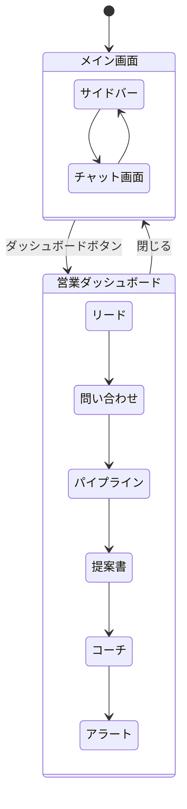

# GIGOOO AIエージェント 画面仕様書

## 概要

営業活動を支援するAIエージェントシステムの画面仕様書です。

## 技術スタック

| 層 | 技術 |
|---|------|
| フロントエンド | React + TypeScript + Vite |
| バックエンド | FastAPI (Python) |
| データベース | SQLite (SQLAlchemy ORM) |
| AI | OpenAI GPT-4 |
| 通信 | REST API + WebSocket |

## ドキュメント構成

```
docs/screens/
├── README.md                    # このファイル（目次）
├── 00-system-overview.md        # システム概要
├── 01-main-layout.md            # メイン画面レイアウト
│
├── agents/                      # AIエージェント画面
│   ├── 01-skill-search.md       # 社内スキル検索
│   ├── 02-lead-management.md    # 見込み客管理
│   ├── 03-progress.md           # 進捗管理
│   ├── 04-inquiry.md            # 問い合わせ対応
│   ├── 05-proposal.md           # 提案資料作成
│   ├── 06-coach.md              # 営業コーチ
│   └── 07-knowledge-base.md     # 会社ナレッジベース
│
├── dashboard/                   # 営業ダッシュボード
│   ├── 00-overview.md           # ダッシュボード概要
│   ├── 01-leads.md              # リード管理タブ
│   ├── 02-inquiries.md          # 問い合わせタブ
│   ├── 03-pipeline.md           # パイプラインタブ
│   ├── 04-proposals.md          # 提案書タブ
│   ├── 05-coach.md              # コーチタブ
│   └── 06-alerts.md             # アラートタブ
│
└── common/                      # 共通仕様
    ├── 01-components.md         # 共通コンポーネント
    ├── 02-api-reference.md      # API連携一覧
    ├── 03-data-structures.md    # データ構造
    └── 04-color-palette.md      # カラーパレット
```

## 画面一覧

### AIエージェント（7種類）

| エージェント | アイコン | 説明 |
|------------|--------|------|
| 社内スキル検索 | 🔍 | スキルシートを参照して人材検索 |
| 見込み客管理 | 📊 | リード分析・優先度判定 |
| 進捗管理 | 📈 | パイプライン分析・ボトルネック特定 |
| 問い合わせ対応 | 💬 | 回答案の自動生成 |
| 提案資料作成 | 📝 | 提案書・見積書の自動生成 |
| 営業コーチ | 🎯 | 商談分析・スキル評価 |
| 会社ナレッジベース | 📚 | 議事録・会社情報の保存・検索 |

### 営業ダッシュボード（6タブ）

| タブ | 説明 |
|-----|------|
| リード管理 | リード一覧・詳細・AI分析 |
| 問い合わせ | 問い合わせ管理・SLA監視 |
| パイプライン | 商談管理・売上予測 |
| 提案書 | 提案書・テンプレート・競合管理 |
| コーチ | スキル評価・商談分析 |
| アラート | 通知・ルール管理 |

## 画面遷移図



## 改訂履歴

| バージョン | 日付 | 内容 |
|-----------|------|------|
| 1.0 | 2026-01-16 | 初版作成 |
