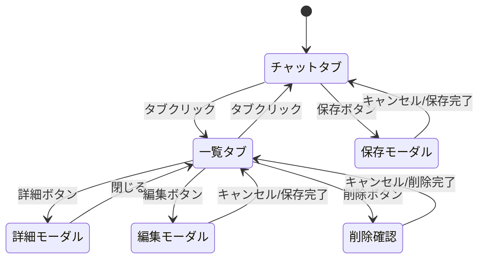

# 会社ナレッジベース (knowledge)

## 1. 概要

| 項目 | 内容 |
|-----|------|
| エージェントID | `knowledge` |
| 名前 | 会社ナレッジベース |
| アイコン | 📚 |
| 説明 | 議事録・会社情報の保存・検索、AI自動抽出 |

## 2. 画面レイアウト

### 2.1 チャットタブ

```
┌─────────────────────────────────────────────────────────────┐
│  📚 会社ナレッジベース                                       │
├─────────────────────────────────────────────────────────────┤
│  👤 田中太郎 ▼              [💬 チャット] [📋 一覧]          │
├─────────────────────────────────────────────────────────────┤
│                                                             │
│  ┌─────────────────────────────────────────────────────┐    │
│  │ 🤖 システム                                         │    │
│  │ 会社ナレッジベースへようこそ！議事録や会社情報を    │    │
│  │ 保存・検索できます。                                │    │
│  └─────────────────────────────────────────────────────┘    │
│                                                             │
│  ┌─────────────────────────────────────────────────────┐    │
│  │ 👤 ユーザー                                         │    │
│  │ 株式会社ABCとの打ち合わせ議事録です。               │    │
│  │ 日時：2026年1月15日 14:00-15:00                     │    │
│  │ 出席者：田中、山田、ABC社 佐藤様                    │    │
│  │ ...                                                 │    │
│  └─────────────────────────────────────────────────────┘    │
│                                                             │
│  ┌─────────────────────────────────────────────────────┐    │
│  │ 🤖 AI抽出結果                    [AI整形] [原文]    │    │
│  │ ┌─────────────────────────────────────────────┐     │    │
│  │ │ 📅 日付: 2026-01-15                         │     │    │
│  │ │ 🏢 会社名: 株式会社ABC                      │     │    │
│  │ │                                             │     │    │
│  │ │ 📝 要約                                     │     │    │
│  │ │ 新規システム導入について協議。来月から      │     │    │
│  │ │ 試験導入を開始することで合意。              │     │    │
│  │ │                                             │     │    │
│  │ │ ✅ 決定事項                                 │     │    │
│  │ │ • 来月から試験導入開始                      │     │    │
│  │ │ • 初期費用は50万円で合意                    │     │    │
│  │ │                                             │     │    │
│  │ │ 📋 宿題                                     │     │    │
│  │ │ • 田中: 見積書作成 (期限: 1/20)             │     │    │
│  │ │ • 山田: 契約書準備 (期限: 1/22)             │     │    │
│  │ │                                             │     │    │
│  │ │ ➡️ 次回アクション                           │     │    │
│  │ │ • 1/25 フォローアップMTG                    │     │    │
│  │ └─────────────────────────────────────────────┘     │    │
│  │                                  [💾 この内容で保存] │    │
│  └─────────────────────────────────────────────────────┘    │
│                                                             │
├─────────────────────────────────────────────────────────────┤
│  ┌─────────────────────────────────────────────────────┐    │
│  │ メッセージを入力...                                 │    │
│  └─────────────────────────────────────────────────────┘    │
│                                          [🔍 検索] [💾 保存]│
└─────────────────────────────────────────────────────────────┘
```

### 2.2 一覧タブ

```
┌─────────────────────────────────────────────────────────────┐
│  📚 会社ナレッジベース                                       │
├─────────────────────────────────────────────────────────────┤
│  👤 田中太郎 ▼              [💬 チャット] [📋 一覧]          │
├─────────────────────────────────────────────────────────────┤
│                                                             │
│  🔍 [会社名で検索...                                ] [検索]│
│                                                             │
│  ┌─────────────────────────────────────────────────────┐    │
│  │ 🏢 株式会社ABC                          2026/01/15  │    │
│  │ 新規システム導入について協議。来月から試験導入...    │    │
│  │                                   👤 田中太郎        │    │
│  │                             [詳細] [編集] [削除]     │    │
│  └─────────────────────────────────────────────────────┘    │
│                                                             │
│  ┌─────────────────────────────────────────────────────┐    │
│  │ 🏢 株式会社XYZ                          2026/01/10  │    │
│  │ 契約更新についての打ち合わせ。現行プランの継続...    │    │
│  │                                   👤 山田花子        │    │
│  │                             [詳細] [編集] [削除]     │    │
│  └─────────────────────────────────────────────────────┘    │
│                                                             │
│                       [< 前へ]  1 / 5  [次へ >]             │
└─────────────────────────────────────────────────────────────┘
```

## 3. 機能一覧

| 機能 | 説明 |
|-----|------|
| メモ保存 | 議事録・会社情報の保存 |
| AI抽出 | 要約・決定事項・宿題を自動抽出 |
| タブ切替 | AI整形表示 / 原文表示 |
| 検索 | 会社名・全文検索 |
| CRUD | メモの閲覧・編集・削除 |
| ユーザー管理 | 登録ユーザーの選択・追加 |

## 4. AI抽出項目

| 項目 | 説明 |
|-----|------|
| summary | 要約（3-5文） |
| decisions | 決定事項のリスト |
| action_items | 宿題（担当者、タスク、期限） |
| next_actions | 次回アクション（アクション、日付） |
| meeting_date | 会議日付 |
| related_projects | 関連案件リスト |

## 5. 画面遷移



## 6. 保存モーダル

```
┌─────────────────────────────────────────────────────────────┐
│                     💾 メモを保存                      [×]  │
├─────────────────────────────────────────────────────────────┤
│                                                             │
│  会社名 *                                                   │
│  ┌─────────────────────────────────────────────────────┐    │
│  │ 株式会社ABC                                     ▼   │    │
│  └─────────────────────────────────────────────────────┘    │
│  💡 既存の会社名から選択、または新規入力                    │
│                                                             │
│  メモ種別                                                   │
│  ┌─────────────────────────────────────────────────────┐    │
│  │ 議事録                                          ▼   │    │
│  └─────────────────────────────────────────────────────┘    │
│                                                             │
│  📝 AI抽出プレビュー                                        │
│  ┌─────────────────────────────────────────────────────┐    │
│  │ 📅 日付: 2026-01-15                                 │    │
│  │ 📝 要約: 新規システム導入について協議...            │    │
│  │ ✅ 決定事項: 来月から試験導入開始                   │    │
│  │ 📋 宿題: 田中 - 見積書作成                          │    │
│  └─────────────────────────────────────────────────────┘    │
│                                                             │
│                              [キャンセル]  [保存する]       │
└─────────────────────────────────────────────────────────────┘
```

## 7. 詳細モーダル

```
┌─────────────────────────────────────────────────────────────┐
│  🏢 株式会社ABC                                        [×]  │
├─────────────────────────────────────────────────────────────┤
│  [AI整形]  [原文]                                           │
├─────────────────────────────────────────────────────────────┤
│                                                             │
│  📅 日付: 2026年1月15日                                     │
│                                                             │
│  ─────────────────────────────────────────────────────────  │
│                                                             │
│  📝 要約                                                    │
│  新規システム導入について協議を行いました。                 │
│  来月から試験導入を開始することで合意。                     │
│                                                             │
│  ─────────────────────────────────────────────────────────  │
│                                                             │
│  ✅ 決定事項                                                │
│  • 来月から試験導入開始                                     │
│  • 初期費用は50万円で合意                                   │
│                                                             │
│  ─────────────────────────────────────────────────────────  │
│                                                             │
│  📋 宿題（アクションアイテム）                              │
│  | 担当者 | タスク       | 期限       |                     │
│  |--------|--------------|------------|                     │
│  | 田中   | 見積書作成   | 2026/01/20 |                     │
│  | 山田   | 契約書準備   | 2026/01/22 |                     │
│                                                             │
│  ─────────────────────────────────────────────────────────  │
│                                                             │
│  ➡️ 次回アクション                                          │
│  • 2026/01/25 - フォローアップMTG                           │
│                                                             │
│  ─────────────────────────────────────────────────────────  │
│  📋 メタ情報                                                │
│  登録者: 田中太郎  │  登録日時: 2026/01/15 14:30            │
│                                                             │
│                                       [編集]  [閉じる]      │
└─────────────────────────────────────────────────────────────┘
```

## 8. API連携

| エンドポイント | Method | 説明 |
|--------------|--------|------|
| `/api/knowledge/memos` | POST | メモ作成（AI抽出付き） |
| `/api/knowledge/memos` | GET | メモ一覧・検索 |
| `/api/knowledge/memos/{id}` | GET | メモ詳細 |
| `/api/knowledge/memos/{id}` | PUT | メモ更新 |
| `/api/knowledge/memos/{id}` | DELETE | メモ削除 |
| `/api/knowledge/extract` | POST | AI抽出プレビュー |
| `/api/knowledge/chat` | POST | 自然言語検索 |
| `/api/knowledge/users` | GET | ユーザー一覧 |
| `/api/knowledge/users` | POST | ユーザー追加 |
| `/api/knowledge/companies` | GET | 会社名一覧 |

## 9. システムプロンプト

```
会社ナレッジベースです。議事録や会社情報を保存・検索できます。
テキストを貼り付けると自動で内容を整理します。
```

## 10. データ構造

### メモデータ

```typescript
interface CompanyMemo {
  id: number;
  company_name: string;
  original_text: string;
  summary: string | null;
  decisions: string[] | null;
  action_items: ActionItem[] | null;
  next_actions: NextAction[] | null;
  meeting_date: string | null;
  related_projects: string[] | null;
  memo_type: 'meeting_note' | 'company_info' | 'other';
  registered_user_name: string | null;
  created_at: string;
  updated_at: string | null;
}

interface ActionItem {
  owner: string;
  task: string;
  deadline: string | null;
}

interface NextAction {
  action: string;
  date: string | null;
}
```

### ユーザーデータ

```typescript
interface SimpleUser {
  id: number;
  name: string;
  department: string | null;
  is_active: boolean;
}
```
