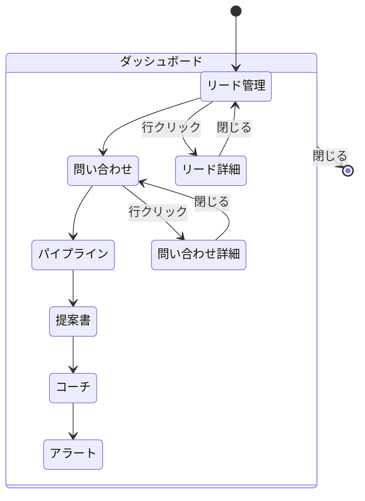

# 営業ダッシュボード 概要

## 1. 概要

営業ダッシュボードは、営業活動の全体像を把握するための管理画面です。
メイン画面からモーダルとして表示されます。

## 2. 全体構成

```
┌─────────────────────────────────────────────────────────────────────────┐
│  営業ダッシュボード                                              [×]   │
├─────────────────────────────────────────────────────────────────────────┤
│  [リード管理] [問い合わせ] [パイプライン] [提案書] [コーチ] [アラート]   │
├─────────────────────────────────────────────────────────────────────────┤
│                                                                         │
│                                                                         │
│                                                                         │
│                           タブコンテンツエリア                          │
│                                                                         │
│                                                                         │
│                                                                         │
│                                                                         │
│                                                                         │
│                                                                         │
└─────────────────────────────────────────────────────────────────────────┘
```

## 3. タブ一覧

| タブ | 説明 | 主な機能 |
|-----|------|---------|
| リード管理 | リード情報の管理 | 一覧、詳細、AI分析 |
| 問い合わせ | 問い合わせ管理 | 一覧、対応、SLA監視 |
| パイプライン | 商談パイプライン | カンバン、予測、滞留アラート |
| 提案書 | 提案書管理 | テンプレート、競合、受注案件 |
| コーチ | 営業コーチ | スキル評価、商談分析 |
| アラート | 通知管理 | アラート一覧、ルール設定 |

## 4. 共通UI要素

### ヘッダー

```
┌─────────────────────────────────────────────────────────────────────────┐
│  営業ダッシュボード                                              [×]   │
└─────────────────────────────────────────────────────────────────────────┘

- タイトル: 「営業ダッシュボード」
- 閉じるボタン: 右上の[×]でモーダルを閉じる
```

### タブナビゲーション

```
[リード管理] [問い合わせ] [パイプライン] [提案書] [コーチ] [アラート]
   ▲
 選択中

- 選択中のタブは背景色変更
- クリックでタブ切替
```

### サマリーカード

```
┌─────────┐ ┌─────────┐ ┌─────────┐
│  ラベル  │ │  ラベル  │ │  ラベル  │
│   数値   │ │   数値   │ │   数値   │
└─────────┘ └─────────┘ └─────────┘

- 主要指標を一目で確認
- クリックでフィルタリング（一部）
```

### データテーブル

```
┌─────────────────────────────────────────────────────────────────┐
│ カラム1     │ カラム2     │ カラム3     │ カラム4     │ 操作  │
├─────────────────────────────────────────────────────────────────┤
│ データ      │ データ      │ データ      │ データ      │ ⋮    │
│ データ      │ データ      │ データ      │ データ      │ ⋮    │
└─────────────────────────────────────────────────────────────────┘

- ヘッダー行は背景色付き
- 行ホバーでハイライト
- 操作列: 詳細、編集、削除など
```

### フィルターバー

```
🔍 フィルター
[ステータス ▼] [優先度 ▼] [担当者 ▼] [+ フィルタ追加]
```

### ページネーション

```
                        [<] 1 2 3 ... 10 [>]
```

## 5. モーダルパターン

### 詳細モーダル

```
┌─────────────────────────────────────────────────────────────┐
│  {タイトル}                                            [×]  │
├─────────────────────────────────────────────────────────────┤
│  [タブ1] [タブ2] [タブ3]                                     │
├─────────────────────────────────────────────────────────────┤
│                                                             │
│                       コンテンツ                            │
│                                                             │
├─────────────────────────────────────────────────────────────┤
│                            [キャンセル] [保存]              │
└─────────────────────────────────────────────────────────────┘
```

### 確認モーダル

```
┌─────────────────────────────────────────────────────────────┐
│                           ⚠️                                │
│                                                             │
│                      {確認メッセージ}                        │
│                                                             │
│              [{キャンセル}]  [{実行}]                        │
└─────────────────────────────────────────────────────────────┘
```

## 6. 画面遷移



## 7. レスポンシブ対応

| 画面幅 | レイアウト変更 |
|--------|---------------|
| > 1200px | フル表示 |
| 900px - 1200px | 一部カラム非表示 |
| < 900px | モバイル表示（スタック） |

## 8. CSS仕様

```css
.dashboard-modal {
  position: fixed;
  top: 0;
  left: 0;
  width: 100%;
  height: 100%;
  background: rgba(0, 0, 0, 0.5);
  display: flex;
  justify-content: center;
  align-items: center;
  z-index: 1000;
}

.dashboard-content {
  width: 90%;
  max-width: 1400px;
  height: 90%;
  background: #1a1a2e;
  border-radius: 12px;
  overflow: hidden;
  display: flex;
  flex-direction: column;
}

.dashboard-tabs {
  display: flex;
  background: #16213e;
  border-bottom: 1px solid #333;
}

.dashboard-tab {
  padding: 16px 24px;
  cursor: pointer;
  border-bottom: 2px solid transparent;
}

.dashboard-tab.active {
  border-bottom-color: #4a9eff;
  background: #1a1a2e;
}
```
